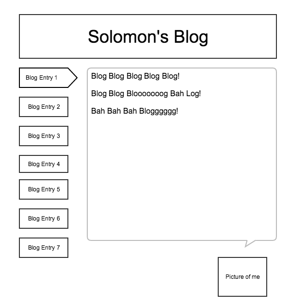

How was it to wireframe and create an HTML page with a pair?

It was hard at first being new to all this. Ian did a good job helping me out understanding what needed to be done.

Did you find wireframing to be helpful to your development process?

Yes, in understanding basic design and flow of how my website will work.

What did you and your pair decide made a good wireframe? 

Being easy to read and go through the website without having to spend a lot of time trying to find things.

What new semantic elements did you learn about (if any) ?

I used a 3rd party website.

